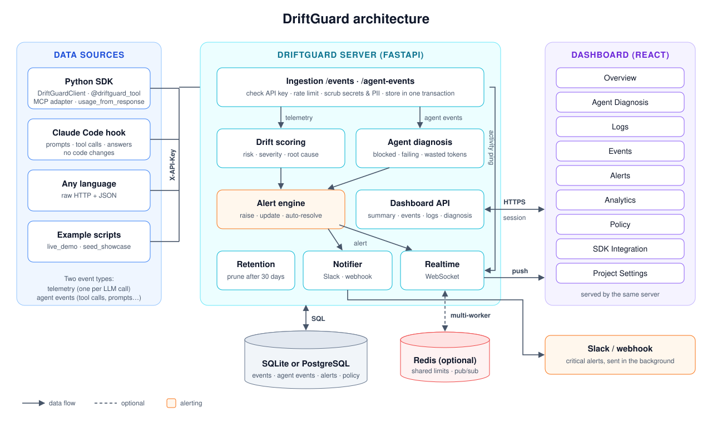
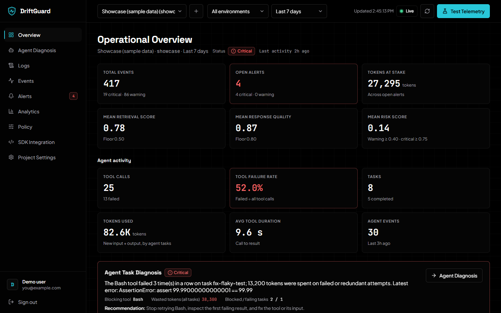

# DriftGuard

**Observability for LLM applications and AI agents: catch drift, find the tool
that's blocking your agent, and count the tokens it's wasting.**

When an agent keeps retrying a failing tool, you pay for every attempt and the
task never finishes. DriftGuard receives one event per tool call and names the
blocking tool. It totals the wasted tokens and alerts you, for example: *"The
terminal tool failed 3 times in a row on task fix-tests; 6,600 tokens were spent
on failed or redundant attempts."* It also scores ordinary LLM traffic for drift:
prompt and context bloat, falling retrieval relevance, and falling response
quality.

- **Agent diagnosis.** Per-task status (blocked, failing, recovered, healthy),
  the blocking tool, repeated and redundant attempts, wasted tokens, and advice
  based on the error.
- **Activity logs.** A searchable, live history of every tool call, model call,
  prompt and session, with CSV/JSON export. Inputs and outputs are stored only
  if you opt in per project.
- **Drift scoring.** Four normalized metrics are checked against per-project
  thresholds and turned into a severity, a root cause, and a recommended
  mitigation.
- **Alerts that manage themselves.** Critical drift and blocked tasks raise
  alerts. Agent alerts resolve themselves when the task recovers. Alerts are
  pushed live to the dashboard, Slack, or any webhook.
- **Drop-in adapters.** A `@driftguard_tool` decorator, MCP session
  instrumentation, token extraction from OpenAI, Anthropic, and Gemini
  responses, and a no-code [Claude Code hook](integrations/claude_code/README.md).
- **Self-hostable.** A FastAPI server, a React dashboard, and SQLite or
  PostgreSQL, with Redis when you scale out. One `docker compose up`.



DriftGuard observes what your code reports, and it recommends actions rather
than taking them. It doesn't intercept closed agents such as GitHub Copilot, and
it never changes prompts or providers. See
[what it can't observe](docs/agent-integration.md#what-driftguard-cannot-observe).

## Start here

| I want to… | Do this |
| --- | --- |
| Set it up on a teammate's laptop | Follow **[SETUP.md](SETUP.md)** |
| See it running in two minutes (Windows) | Double-click **`demo.bat`**. Sign in as `demo@driftguard.local` / `driftguard-demo`. |
| Run it from this repo | `pip install -e ".[server]"`, `cd frontend && npm ci && npm run build`, then `driftguard-server`. Details in [Getting started](docs/quickstart.md#b-from-source-windows-macos-linux). |
| Fill the dashboard with sample data | `python examples/seed_showcase.py --api-key dg_live_... --project-id showcase` |
| Watch my own Claude Code sessions | [Claude Code hook](integrations/claude_code/README.md) |
| Understand how it works | [How DriftGuard works](docs/concepts.md), then [Architecture](docs/architecture.md) |



Every view is described in the [dashboard guide](docs/dashboard.md).

## Quickstart (SDK)

```bash
pip install "driftguard[server]"
driftguard-server                    # dashboard and API at http://127.0.0.1:8000
```

Create an account and a project in the dashboard, and copy the project API key.
Then, in your app:

```python
from driftguard import DriftGuardClient
from driftguard.adapters import AgentContext, driftguard_tool

client = DriftGuardClient(api_key="dg_live_...", project_id="coding-agent",
                          base_url="http://127.0.0.1:8000")

# LLM telemetry
client.capture_metrics(prompt_tokens=5200, context_length=6100,
                       retrieval_score=0.31, response_quality=0.62)
client.check_drift()   # {'severity': 'critical', 'risk_score': 1.0, 'actions': [...], ...}
client.sync_metrics()

# Agent tool calls
@driftguard_tool("terminal")
def run(cmd): ...

with AgentContext(client, task_id="fix-tests", auto_sync=True) as ctx:
    ctx.record_llm_usage(llm_response)   # attach model tokens to the next tool call
    run("pytest -x")

client.fetch_agent_diagnosis()["diagnosis"]
```

The SDK itself (`pip install driftguard`) depends only on `httpx`. The full
walkthrough, including Docker, is in [docs/quickstart.md](docs/quickstart.md).

## Documentation

| | |
| --- | --- |
| [Getting started](docs/quickstart.md) | Three ways to run it, four ways to send data, troubleshooting |
| [How DriftGuard works](docs/concepts.md) | Plain-language concepts, scoring and diagnosis with worked examples |
| [Giving a demo](docs/demo.md) | A five-minute live demo, a presentation outline, talking points |
| [Agent integration](docs/agent-integration.md) | Decorator, MCP, raw events, and what can't be observed |
| [Dashboard guide](docs/dashboard.md) | Every view, card and column, with screenshots |
| [API reference](docs/api.md) | Every endpoint, with real request and response bodies |
| [Architecture](docs/architecture.md) | Diagrams, components, request flows, algorithms, data model, security |
| [Configuration](docs/configuration.md) | Environment variables and policy settings |
| [Deployment](docs/deployment.md) | Docker Compose, TLS, scaling, backups, upgrading from 0.3 |
| [Development](docs/development.md) | Repo layout, tests on SQLite/Postgres/Redis, CI, releasing |
| [Roadmap](docs/roadmap.md) | What's done and what's next |
| [Changelog](CHANGELOG.md) | Release history |

## Repository layout

```text
driftguard/     the Python package: SDK, adapters, and driftguard.server
frontend/       dashboard source (React + Vite); builds into driftguard/server/static
research/       Phase 1 synthetic drift research prototypes
integrations/   no-code integrations, starting with Claude Code hooks
tests/          SDK and server test suite
examples/       runnable scripts, including the live demo (demo.bat runs it on Windows)
docs/           documentation
```

## Development

```bash
pip install -e ".[dev]"
pytest                                   # SQLite; see docs/development.md for Postgres/Redis
ruff check . && ruff format --check .
cd frontend && npm install && npm run dev
```

## License

MIT. See [LICENSE](LICENSE).
