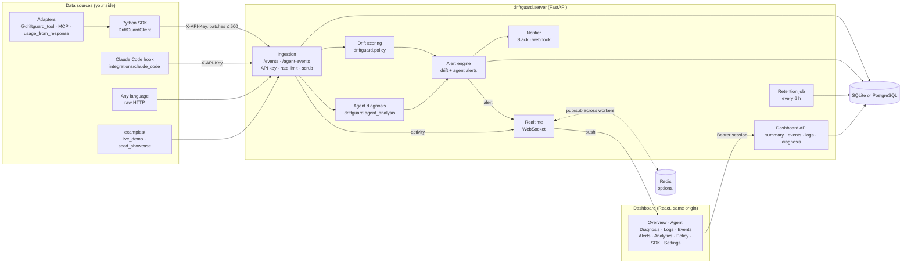
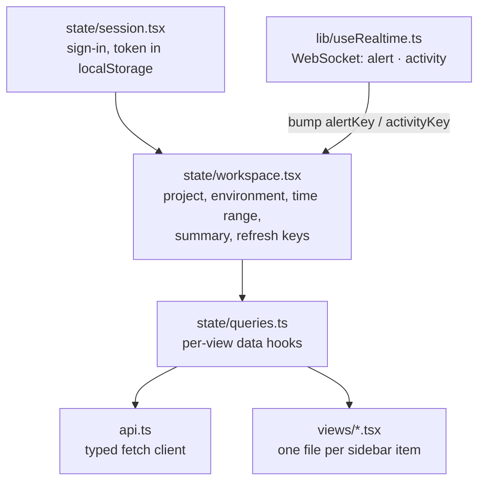
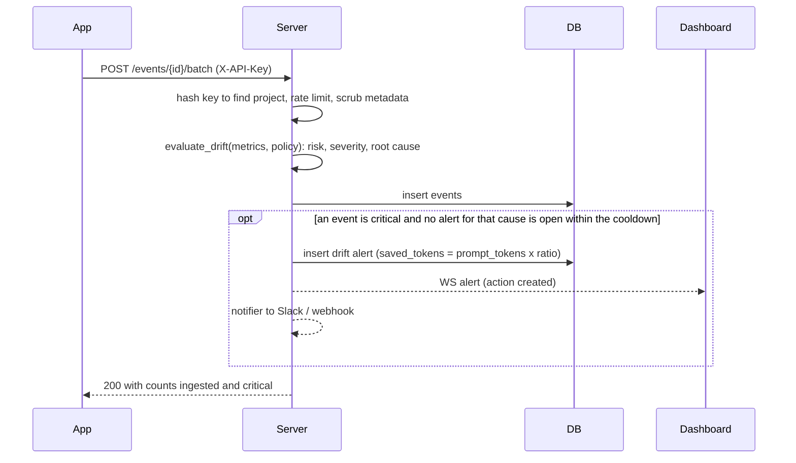
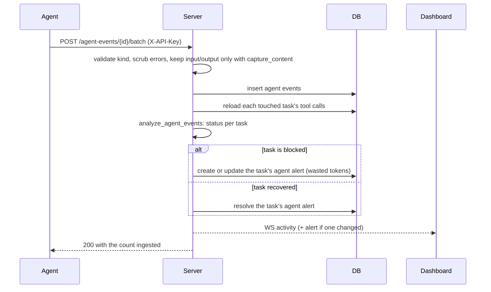
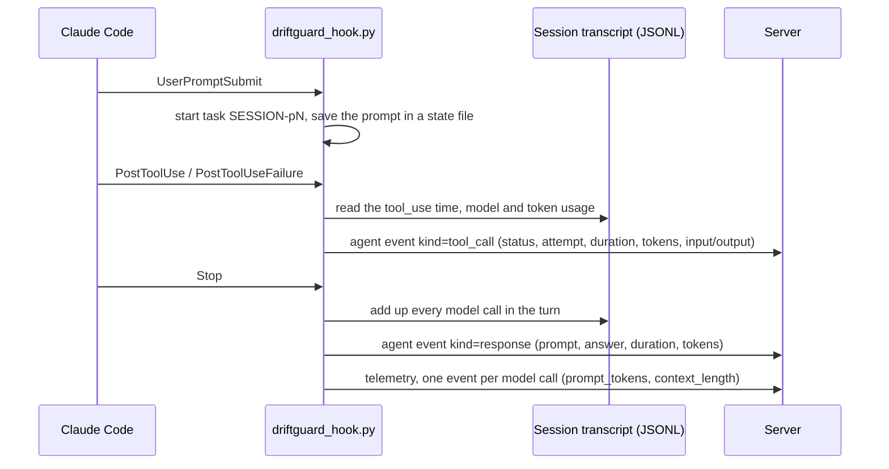

# Architecture

DriftGuard has three parts, plus the integrations that feed it:

- **Data sources** run next to your app or agent: the Python SDK and its
  adapters, the Claude Code hook, or any HTTP client. They send events.
- The **server** (FastAPI) checks, scores, diagnoses and stores those events,
  raises alerts, and pushes changes live.
- The **dashboard** (React) is served by the same server and only reads from the
  API.

For a plain-language version, see [concepts.md](concepts.md).

## The big picture

A PNG copy for slides is at [images/architecture.png](images/architecture.png).

The same diagram as editable Mermaid

**Reading the diagram:** sources on the left send events with the project API
key. The server scores and diagnoses each batch in the same transaction that
stores it. Alerts and a lightweight `activity` ping go out over the WebSocket,
and the dashboard re-reads the view you're looking at. Redis is only needed with
more than one server worker.

## Package layout

| Path | Contents | Dependencies |
| --- | --- | --- |
| `driftguard/client.py` | `DriftGuardClient`: capture, batch sync, policy fetch, offline `check_drift`, the `capture_content` switch | `httpx` |
| `driftguard/policy.py` | `DEFAULT_POLICY`, `evaluate_drift`, `recommend_mitigation`. The SDK and the server use the same code. | none |
| `driftguard/agent_analysis.py` | `analyze_agent_events`: the diagnosis algorithm | none |
| `driftguard/adapters/` | `AgentContext` and `@driftguard_tool`, `record_activity`, `MCPMiddleware`, `usage_from_response` | none |
| `driftguard/server/` | The server; see [server modules](#server-modules) | `[server]` extra |
| `driftguard/server/static/` | Built dashboard. Generated by `frontend/` and not committed. | |
| `frontend/` | React 19 + Vite + Tailwind dashboard source | Node 22 |
| `integrations/claude_code/` | `driftguard_hook.py`: the Claude Code hook (standard library only) | Python 3.10+ |
| `examples/` | `live_demo.py` (scripted demo) and `seed_showcase.py` (a week of sample data) | `httpx` |
| `research/` | Phase 1 synthetic feature-drift prototypes. Not imported by the product. | `[research]` extra |
| `tests/` | pytest suite for the SDK, server, adapters and hook | `[dev]` extra |

`import driftguard` never imports FastAPI, SQLAlchemy, or NumPy, and a test
enforces this.

### Server modules

| Module | Responsibility |
| --- | --- |
| `app.py` | `create_app()`: routes, auth dependencies, ingestion, exports, WebSocket, static dashboard |
| `service.py` | `DriftGuardService`: every database read and write, scoring on ingest, alert creation and resolution, summary and activity aggregates |
| `db.py` | Table definitions and `init_db` (creates tables, adds new columns, hashes v0.3 keys) |
| `schemas.py` | Pydantic request models and limits (for example `MAX_CONTENT = 2000`) |
| `security.py` | scrypt passwords, JWT sessions, API key generation and hashing |
| `ratelimit.py` | Sliding-window rate limits, in memory or in Redis |
| `realtime.py` | WebSocket broadcaster, with Redis pub/sub fan-out |
| `notifications.py` | Slack and webhook delivery on a background thread |
| `retention.py` | Secret and PII scrubbing; the periodic prune job |
| `settings.py` | Environment variables and `.env` |
| `cli.py` | The `driftguard-server` command (wraps uvicorn) |

## The dashboard

- **Routing** is by URL hash (`#/logs`), so a reload keeps the current view.
- **State.** The workspace holds the selected project and filters, which are
  remembered in `localStorage`, and the Overview summary. Each view loads its
  own data through `state/queries.ts`.
- **Live updates.** An `alert` message refreshes alerts and the summary. An
  `activity` message bumps a debounced (750 ms) `activityKey`, which makes
  Logs, Agent Diagnosis and the Overview re-fetch. The project list and the
  open view also reload when the browser tab becomes visible again.
- **No invented data.** The browser formats numbers but never computes
  metrics. Every figure comes from the API, and a missing value shows as **—**.

| View | Reads |
| --- | --- |
| Overview | `GET /projects/{id}/summary`, `…/events?limit=500` (timeline), `…/agent-diagnosis`, `…/alerts?resolved=false&limit=5` |
| Agent Diagnosis | `GET /projects/{id}/agent-diagnosis`, `GET /projects/{id}/agent-events?kind=tool_call` |
| Logs | `GET /projects/{id}/agent-events` (filters, search, paging), `…/agent-events/export` |
| Events | `GET /projects/{id}/events` (100 at a time) |
| Analytics | `GET /projects/{id}/events?limit=500`, `…/summary` |
| Alerts | `GET`/`POST`/`PATCH /projects/{id}/alerts` |
| Policy | `GET`/`PUT /projects/{id}/policy` |
| Project Settings | `PATCH /projects/{id}`, `POST /projects/{id}/api-key`, `DELETE /projects/{id}` |

## Flows

### A telemetry event (LLM call)

### An agent event (tool call)

### Claude Code hook

Hooks don't receive durations or tokens, so the hook reads them from the
session transcript. It never blocks Claude Code: it uses only the standard
library, times out after 2 seconds, and always exits 0. See the
[integration README](../integrations/claude_code/README.md).

## Request flow in detail

1. The SDK queues events in memory. The queue is bounded at 10,000 per type and
   drops the oldest event when full. Each event is stamped with `occurred_at`.
   `sync_*` sends the queue in batches of up to 500. A batch that fails stays
   queued, in order, for the next sync.
2. The ingestion endpoints check the `X-API-Key` header by hashing it and looking
   the hash up. They then scrub PII from free text and store the rows in one
   transaction.
3. Each telemetry event is scored with `evaluate_drift` against the project's
   policy. The severity, risk score, root cause, and recommendation are stored
   with the event. A critical event raises a `drift` alert, at most one per root
   cause per cooldown.
4. For agent events, the server re-diagnoses the affected tasks in the same
   transaction. It raises, updates, or resolves one `agent` alert per task.
5. New and changed alerts go to the notifier (Slack or webhook, on a background
   thread) and to the broadcaster (WebSocket clients, fanned out through Redis
   when it's configured). Every agent batch also publishes an `activity`
   message.

## Drift scoring

`evaluate_drift(metrics, policy)` adds a fixed weight for each rule the metrics
break:

| Rule | Violated when | Risk |
| --- | --- | ---: |
| `prompt_token_limit` | `prompt_tokens >` limit | 0.25 |
| `retrieval_score_floor` | `retrieval_score <` floor | 0.35 |
| `context_length_limit` | `context_length >` limit | 0.20 |
| `response_quality_floor` | `response_quality <` floor | 0.20 |

The total is capped at 1.0. Severity is `stable` below 0.4, `warning` from 0.4 up
to 0.75, and `critical` from 0.75. A metric that's missing never counts as a
violation.

`recommend_mitigation` uses the **same thresholds** to choose actions:

- `compress_prompt_context` for prompt or context inflation
- `trim_retrieval_results` for retrieval degradation
- `fallback_to_lower_cost_model` for a quality drop

It also returns an estimated savings ratio, capped at 0.6. For a drift alert,
`saved_tokens` is `prompt_tokens × ratio`.

These are recommendations only. DriftGuard never changes prompts, models, or
providers.

## Agent diagnosis

`analyze_agent_events(events, policy)` groups events by `task_id` and replays
each task in time order. Only `tool_call` events are passed in. Prompts, model
calls and session events are stored for the activity log but don't affect a
task's status.

- **Runs.** For each tool it tracks the current run of consecutive failures. A
  success of the **same tool** ends the run. Success of a different tool doesn't.
- **Retry window.** A failure more than `retry_window_minutes` after the
  previous one starts a new run, so old failures don't chain with new ones. Set
  the window to `0` to turn this off.
- **Task status.**
  - **blocked**: an open run of at least `blocked_after_failures` (default 3)
  - **failing**: a shorter open run
  - **recovered**: it failed earlier, but every run was closed by a success
  - **healthy**: no failures
- **Blocking tool.** The tool with the longest open run. A tie goes to the most
  recent failure.
- **Repeated attempts.** Failures after the first in a run.
- **Redundant attempts.** Successful calls whose `(tool_name, input_hash)`
  already succeeded earlier in the task.
- **Wasted tokens.** Tokens of every failed attempt plus every redundant attempt.
  An event's tokens are `total_tokens`, or `prompt_tokens + completion_tokens`.
- **Recommendation.** Based on keywords in the error type or message: timeout,
  permission, not found, rate limit, or malformed input. Anything else gets
  generic advice.

The response lists every task, most urgent first. The top-level fields describe
the most urgent task, so older SDK callers that read `status`, `blocking_tool`
and `wasted_tokens` keep working.

## Agent activity totals

The Overview's *Agent activity* row is computed in SQL over the same rows that
Logs lists, for the selected environment and time range:

- **tool calls** and **failed tool calls**: rows of kind `tool_call`, with
  failures by status (`failed`, `failure`, `error`, `timeout`);
- **failure rate**: failed ÷ tool calls;
- **tasks**: distinct task IDs; **turns**: rows of kind `response`;
- **tokens used**: per task, the `response` row's total if it has one, or else
  the sum of its tool calls. This avoids counting a turn twice;
- **average tool duration**, and the time of the **last activity**.

## Data model

| Table | Key columns |
| --- | --- |
| `accounts` | `account_id`, `name`, `email` (unique), `password_hash` (scrypt) |
| `auth_sessions` | `jti`, `account_id`, `expires_at`, `revoked_at` |
| `projects` | `project_id` (globally unique), `account_id`, `environment`, `api_key_hash` (SHA-256, unique), `api_key_hint`, `capture_content` |
| `policies` | `project_id` plus the six thresholds |
| `events` | metrics, `environment`, `risk_score`, `severity`, `root_cause`, `recommendation`, `extra_json`, `created_at` |
| `agent_events` | the event fields above, `kind`, `input_text` and `output_text` (only with `capture_content`), `created_at` |
| `alerts` | `severity`, `message`, `saved_tokens`, `source` (manual/drift/agent), `task_id`, `root_cause`, `resolved`, `created_at` |

All timestamps are stored in UTC. On startup `init_db` does four things:

- creates any missing tables
- adds columns introduced since v0.3
- replaces v0.3 plaintext API keys with their hashes
- creates indexes

No separate migration step is needed. On PostgreSQL this runs under an advisory
lock, so several workers can start at once safely.

## Security model

- **Passwords** are hashed with scrypt (N=2¹⁴, r=8, p=1) and a per-account salt.
  Login takes the same time whether or not the account exists.
- **Sessions** are HS256 JWTs signed with `DRIFTGUARD_SECRET_KEY`. Each token's
  `jti` is stored, so logout and account deletion revoke it on the server.
  Production refuses to start with the development secret or one shorter than
  32 characters.
- **API keys** (`dg_live_` + 256 bits) are stored only as hashes and shown once.
  A key reaches only its own project. It can ingest data and read that
  project's data, but can't change policy, rotate keys, resolve alerts, or
  delete anything.
- **Isolation.** A project owned by another account returns `404`, not `403`.
  Project IDs can't be taken over, because creating an ID that already exists
  returns `409`.
- **Rate limits** apply per session or API key for the API (per IP when
  unauthenticated), per IP for login, and per API key for ingestion. They're shared across workers through an atomic Redis script.
- **Scrubbing.** Before storage, error messages and metadata strings are
  scrubbed of common credentials (OpenAI and Anthropic `sk-` keys, GitHub
  tokens, AWS keys, Google API keys, Slack tokens, bearer tokens, private keys,
  DriftGuard keys), emails, US SSNs, and Luhn-valid card numbers.
- **Headers.** Every response sets `nosniff`, `X-Frame-Options: DENY` and
  `Referrer-Policy: no-referrer`. Production also sets HSTS.
- **TLS** is not handled by the app. Run it behind a TLS-terminating proxy; see
  [deployment.md](deployment.md).

## Scaling notes

- The server keeps no state in process memory except WebSocket connections and
  the in-memory rate limiter. With `REDIS_URL` set, both are shared, and any
  number of workers or replicas can run.
- SQLite is for development and single-node use. Use PostgreSQL for production.
- Dashboard queries filter and aggregate in SQL, using indexes on
  `(project_id, created_at)`.
- A diagnosis reads at most 5,000 recent agent events per request. Use
  `time_range` to narrow it.
