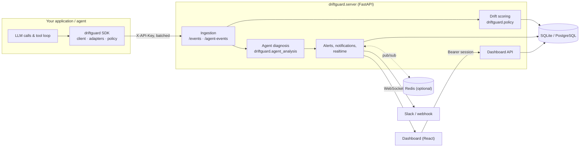

# Architecture

DriftGuard has three parts:

- a Python **SDK** that runs inside your application
- a **server** that stores and analyses telemetry
- a **dashboard** that the server hosts

## Package layout

| Path | Contents | Dependencies |
| --- | --- | --- |
| `driftguard/client.py` | `DriftGuardClient`: capture, batch sync, policy fetch, offline `check_drift` | `httpx` |
| `driftguard/policy.py` | `DEFAULT_POLICY`, `evaluate_drift`, `recommend_mitigation`. The SDK and the server use the same code. | none |
| `driftguard/agent_analysis.py` | `analyze_agent_events`: the diagnosis algorithm | none |
| `driftguard/adapters/` | `AgentContext` and `@driftguard_tool`, `MCPMiddleware`, `usage_from_response` | none |
| `driftguard/server/` | FastAPI app factory, SQLAlchemy schema and service, auth, rate limiting, realtime, retention, notifications | `[server]` extra |
| `driftguard/server/static/` | Built dashboard. Generated by `frontend/` and not committed. | |
| `frontend/` | React 19 + Vite + Tailwind dashboard source | Node 22 |
| `research/` | Phase 1 synthetic feature-drift prototypes. Not imported by the product. | `[research]` extra |

`import driftguard` never imports FastAPI, SQLAlchemy, or NumPy, and a test
enforces this.

## Request flow

1. The SDK queues events in memory. The queue is bounded at 10,000 per type and
   drops the oldest event when full. Each event is stamped with `occurred_at`.
   `sync_*` sends the queue in batches of up to 500. A batch that fails stays
   queued, in order, for the next sync.
2. The ingestion endpoints check the `X-API-Key` header by hashing it and looking
   the hash up. They then scrub PII from free text and store the rows in one
   transaction.
3. Each telemetry event is scored with `evaluate_drift` against the project's
   policy. The severity, risk score, root cause, and recommendation are stored
   with the event. A critical event raises a `drift` alert, at most one per root
   cause per cooldown.
4. For agent events, the server re-diagnoses the affected tasks in the same
   transaction. It raises, updates, or resolves one `agent` alert per task.
5. New and changed alerts go to the notifier (Slack or webhook, on a background
   thread) and to the broadcaster (WebSocket clients, fanned out through Redis
   when it's configured).

## Drift scoring

`evaluate_drift(metrics, policy)` adds a fixed weight for each rule the metrics
break:

| Rule | Violated when | Risk |
| --- | --- | ---: |
| `prompt_token_limit` | `prompt_tokens >` limit | 0.25 |
| `retrieval_score_floor` | `retrieval_score <` floor | 0.35 |
| `context_length_limit` | `context_length >` limit | 0.20 |
| `response_quality_floor` | `response_quality <` floor | 0.20 |

The total is capped at 1.0. Severity is `stable` below 0.4, `warning` from 0.4 up
to 0.75, and `critical` from 0.75. A metric that's missing never counts as a
violation.

`recommend_mitigation` uses the **same thresholds** to choose actions:

- `compress_prompt_context` for prompt or context inflation
- `trim_retrieval_results` for retrieval degradation
- `fallback_to_lower_cost_model` for a quality drop

It also returns an estimated savings ratio, capped at 0.6. For a drift alert,
`saved_tokens` is `prompt_tokens × ratio`.

These are recommendations only. DriftGuard never changes prompts, models, or
providers.

## Agent diagnosis

`analyze_agent_events(events, policy)` groups events by `task_id` and replays
each task in time order.

- **Runs.** For each tool it tracks the current run of consecutive failures. A
  success of the **same tool** ends the run. Success of a different tool doesn't.
- **Retry window.** A failure more than `retry_window_minutes` after the
  previous one starts a new run, so old failures don't chain with new ones. Set
  the window to `0` to turn this off.
- **Task status.**
  - **blocked**: an open run of at least `blocked_after_failures` (default 3)
  - **failing**: a shorter open run
  - **recovered**: it failed earlier, but every run was closed by a success
  - **healthy**: no failures
- **Blocking tool.** The tool with the longest open run. A tie goes to the most
  recent failure.
- **Repeated attempts.** Failures after the first in a run.
- **Redundant attempts.** Successful calls whose `(tool_name, input_hash)`
  already succeeded earlier in the task.
- **Wasted tokens.** Tokens of every failed attempt plus every redundant attempt.
  An event's tokens are `total_tokens`, or `prompt_tokens + completion_tokens`.
- **Recommendation.** Based on keywords in the error type or message: timeout,
  permission, not found, rate limit, or malformed input. Anything else gets
  generic advice.

The response lists every task, most urgent first. The top-level fields describe
the most urgent task, so older SDK callers that read `status`, `blocking_tool`
and `wasted_tokens` keep working.

## Data model

| Table | Key columns |
| --- | --- |
| `accounts` | `account_id`, `name`, `email` (unique), `password_hash` (scrypt) |
| `auth_sessions` | `jti`, `account_id`, `expires_at`, `revoked_at` |
| `projects` | `project_id` (globally unique), `account_id`, `environment`, `api_key_hash` (SHA-256, unique), `api_key_hint` |
| `policies` | `project_id` plus the six thresholds |
| `events` | metrics, `environment`, `risk_score`, `severity`, `root_cause`, `recommendation`, `extra_json`, `created_at` |
| `agent_events` | the event fields above, `created_at` |
| `alerts` | `severity`, `message`, `saved_tokens`, `source` (manual/drift/agent), `task_id`, `root_cause`, `resolved`, `created_at` |

All timestamps are stored in UTC. On startup `init_db` does four things:

- creates any missing tables
- adds columns introduced since v0.3
- replaces v0.3 plaintext API keys with their hashes
- creates indexes

No separate migration step is needed. On PostgreSQL this runs under an advisory
lock, so several workers can start at once safely.

## Security model

- **Passwords** are hashed with scrypt (N=2¹⁴, r=8, p=1) and a per-account salt.
  Login takes the same time whether or not the account exists.
- **Sessions** are HS256 JWTs signed with `DRIFTGUARD_SECRET_KEY`. Each token's
  `jti` is stored, so logout and account deletion revoke it on the server.
  Production refuses to start with the development secret or one shorter than
  32 characters.
- **API keys** (`dg_live_` + 256 bits) are stored only as hashes and shown once.
  A key reaches only its own project. It can ingest data and read that
  project's data, but can't change policy, rotate keys, resolve alerts, or
  delete anything.
- **Isolation.** A project owned by another account returns `404`, not `403`.
  Project IDs can't be taken over, because creating an ID that already exists
  returns `409`.
- **Rate limits** apply per session or API key for the API (per IP when
  unauthenticated), per IP for login, and per API key for ingestion. They're shared across workers through an atomic Redis script.
- **Scrubbing.** Before storage, error messages and metadata strings are
  scrubbed of common credentials (OpenAI and Anthropic `sk-` keys, GitHub
  tokens, AWS keys, Google API keys, Slack tokens, bearer tokens, private keys,
  DriftGuard keys), emails, US SSNs, and Luhn-valid card numbers.
- **Headers.** Every response sets `nosniff`, `X-Frame-Options: DENY` and
  `Referrer-Policy: no-referrer`. Production also sets HSTS.
- **TLS** is not handled by the app. Run it behind a TLS-terminating proxy; see
  [deployment.md](deployment.md).

## Scaling notes

- The server keeps no state in process memory except WebSocket connections and
  the in-memory rate limiter. With `REDIS_URL` set, both are shared, and any
  number of workers or replicas can run.
- SQLite is for development and single-node use. Use PostgreSQL for production.
- Dashboard queries filter and aggregate in SQL, using indexes on
  `(project_id, created_at)`.
- A diagnosis reads at most 5,000 recent agent events per request. Use
  `time_range` to narrow it.
