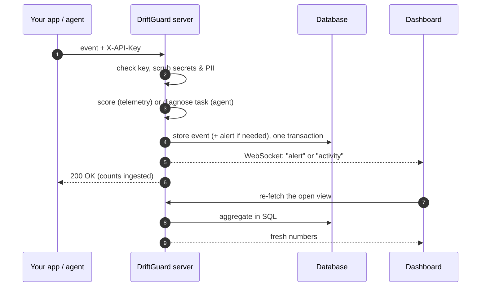

# How DriftGuard works

This is the plain-language explanation. It covers what problem DriftGuard
solves, what data it collects, and how it turns that data into the verdicts on
the dashboard. Use it to understand the project, or to explain it to someone
else. The formal details are in [architecture.md](architecture.md).

## The problem in one minute

LLM applications and AI agents rarely fail loudly. They get **worse quietly**,
and they **waste money**.

- **Drift.** Over weeks, prompts grow because more history and more documents
  are stuffed in. Retrieval starts returning less relevant documents, and
  answers get worse. Nothing crashes, so nobody notices until users complain or
  the bill arrives.
- **Stuck agents.** An agent such as a coding assistant calls tools: it runs
  tests, edits files and searches the web. When a tool keeps failing, the agent
  often just retries it, again and again. Every retry costs model tokens, and
  the task never finishes.

DriftGuard watches both. It answers three questions:

1. **Is my LLM app drifting?** Which metric moved, how bad is it, and what
   should I do?
2. **Is my agent stuck?** Which task, which tool, and why?
3. **How many tokens is it wasting?**

It **observes and recommends**. It never changes your prompts, models or
providers.

## The two kinds of data

Everything on the dashboard comes from two kinds of events that your
application (or an integration) sends.

| | Telemetry event | Agent event |
| --- | --- | --- |
| **One per…** | LLM request | thing an agent does: a tool call, a prompt, an answer |
| **Carries** | `prompt_tokens`, `context_length`, `retrieval_score`, `response_quality` | task, tool, status, error, attempt, duration, tokens, optionally the input and output |
| **Used for** | Drift scoring and drift alerts | Agent diagnosis, agent alerts, Logs |
| **Sent to** | `POST /events/{project}` | `POST /agent-events/{project}` |
| **Dashboard views** | Overview, Events, Analytics | Agent Diagnosis, Logs, Overview's *Agent activity* row |

Both are sent with the **project API key** and stored in the same database.

## Glossary

| Term | Meaning |
| --- | --- |
| **Account** | A person who signs in with an email and password. |
| **Project** | One application or agent being monitored. It has its own API key, policy, data and alerts. An account can own many projects. |
| **Environment** | `prod`, `staging`, `dev` or `test`. Every event is tagged with one, and the dashboard can filter by it. |
| **API key** | `dg_live_…`. What your app uses to send data for **one** project. Stored only as a hash, so it's shown once. |
| **Policy** | The project's thresholds: how many tokens is too many, how low a score is too low, and how many failures in a row make a task blocked. |
| **Risk score** | 0 to 1. How badly one telemetry event breaks the policy. |
| **Severity** | `stable`, `warning` or `critical`, worked out from the risk score. |
| **Root cause** | A one-phrase reason for the risk, such as `retrieval degradation`. Several causes are joined with `;`. |
| **Task** | One unit of agent work, such as "fix the login bug". Every agent event names its task (`task_id`). |
| **Tool call** | One time an agent used a tool. It succeeded or failed. |
| **Blocked** | The same tool failed N times in a row (default 3) in a task, and hasn't succeeded since. |
| **Wasted tokens** | Tokens spent on failed attempts, plus repeats of calls that had already succeeded. |
| **Alert** | Something that needs attention. It's raised automatically for critical drift and for blocked tasks, and can also be created by hand. |

## How a telemetry event is scored

Each event is checked against four rules in the project's policy. Each broken
rule adds a fixed amount of risk:

| Rule | Broken when | Adds | Root cause it suggests |
| --- | --- | ---: | --- |
| Prompt token limit (default 3000) | `prompt_tokens` is **above** it | 0.25 | prompt context inflation |
| Retrieval score floor (0.50) | `retrieval_score` is **below** it | 0.35 | retrieval degradation |
| Context length limit (4000) | `context_length` is **above** it | 0.20 | prompt context inflation |
| Response quality floor (0.80) | `response_quality` is **below** it | 0.20 | response quality degradation |

The total is capped at 1.0. Then:

```text
risk  < 0.40          → stable
0.40 ≤ risk < 0.75    → warning
risk ≥ 0.75           → critical   → raises a drift alert
```

**Worked examples** (default policy):

| Event | Broken rules | Risk | Severity |
| --- | --- | ---: | --- |
| 1,200 prompt tokens, retrieval 0.82, quality 0.91 | none | 0.00 | stable |
| 3,600 prompt tokens, everything else fine | prompt | 0.25 | stable |
| 3,600 prompt tokens, retrieval 0.41 | prompt + retrieval | 0.60 | warning |
| 5,200 prompt tokens, 6,100 context, retrieval 0.31, quality 0.62 | all four | 1.00 | **critical** |

A metric that wasn't sent never breaks a rule. That's why one broken rule on
its own stays **stable**: a single limit crossed is a signal, not yet drift.

Each verdict comes with a **recommendation**:

- prompt or context inflation → *compress prompt context* (saves about 20% of prompt tokens)
- retrieval degradation → *trim retrieval results* (about 15%)
- a quality drop → *fall back to a lower-cost model for non-critical requests* (about 10%)

The savings add up, capped at 60%, and appear as **tokens at stake** on the
alert.

**Alerts don't spam.** After a drift alert, the same root cause in the same
environment doesn't raise another for 15 minutes (the cooldown) while the first
is still open.

## How an agent is diagnosed

DriftGuard replays each task's tool calls in order and follows each tool's
run of failures in a row.

**Example: task `fix-login-bug`**

| # | Tool | Result | What DriftGuard concludes |
| ---: | --- | --- | --- |
| 1 | `read_file` | success | healthy |
| 2 | `run_tests` | **failed** (timeout) | failing: 1 failure in a row |
| 3 | `run_tests` | **failed** (timeout) | failing: 2 in a row; this is a *repeated attempt* |
| 4 | `run_tests` | **failed** (timeout) | **blocked**: 3 in a row → agent alert raised |
| 5 | `edit_file` | success | still blocked: a *different* tool succeeding doesn't help |
| 6 | `run_tests` | success | **recovered** → the alert resolves itself |

From those rows it reports:

- **status**: blocked, failing, recovered or healthy;
- **blocking tool**: the tool with the longest open run of failures (`run_tests`);
- **repeated attempts**: failures after the first in a run (rows 3 and 4);
- **redundant attempts**: a success that repeats an identical input that had
  already succeeded, such as reading the same file twice;
- **wasted tokens**: the tokens of every failed attempt plus every redundant
  one;
- **recommendation**: based on the error. A timeout suggests raising the
  timeout or splitting the work; "permission denied" suggests checking
  credentials. Not found, rate limit and malformed input get their own advice.

Failures more than 60 minutes apart (the *retry window*) don't chain together,
so an old failure doesn't make today's task look blocked.

## What happens to one event, end to end



The dashboard never makes numbers up. Every card and chart is a query over
stored events, and a value that isn't there shows as **—**.

## Where the data comes from

| Source | What it is | Sends |
| --- | --- | --- |
| **Python SDK** (`DriftGuardClient`) | A small library you call from your app | Telemetry and agent events |
| **`@driftguard_tool` decorator** | Wraps a Python function so every call is recorded | Agent events (tool calls) |
| **MCP adapter** | Wraps an MCP client session | Agent events for every MCP tool |
| **Claude Code hook** | A script Claude Code runs on every prompt, tool use and answer | Agent events, plus telemetry per model call |
| **Raw HTTP** | Any language, by posting JSON | Either |
| **`examples/` scripts** | The live demo and the sample-data seeder | Either; demo data only |

## Privacy and safety in one paragraph

By default only **metadata** is stored: tool names, statuses, errors, timings,
token counts and scores. Inputs and outputs, such as the command an agent ran
or the prompt, are stored only if a project turns on **content storage** *and*
the sender allows it. Everything is scrubbed for API keys, tokens, emails and
card numbers first, and cut to 2,000 characters. Data older than 30 days is
deleted automatically. Passwords are hashed with scrypt, API keys are stored
only as hashes, and one account can never see another account's projects.

## What it can't do

- It only sees what is **reported** to it. It can't look inside a closed agent
  such as GitHub Copilot.
- It doesn't judge answers on its own. Response quality has to come from the
  app's own evaluator, so sources without one (like Claude Code) leave it
  blank.
- It **recommends**; it never acts on your prompts or providers.

## Explaining it in 60 seconds

> "LLM apps and agents get worse quietly and waste tokens. DriftGuard is a
> self-hosted monitor for that. Apps send it one small event per model call
> and per tool call. It scores every model call against thresholds: too many
> tokens, poor retrieval, poor answers. Critical drift raises an alert with a
> root cause and a fix. For agents, it replays each task's tool calls. When the
> same tool fails three times in a row, the task is marked blocked, and the
> alert says which tool, why, and how many tokens went to waste. When the
> agent recovers, the alert closes itself. Everything is live on the
> dashboard, and here it's connected to my real Claude Code sessions."

Then show the Overview, open Agent Diagnosis, and finish on Logs.
