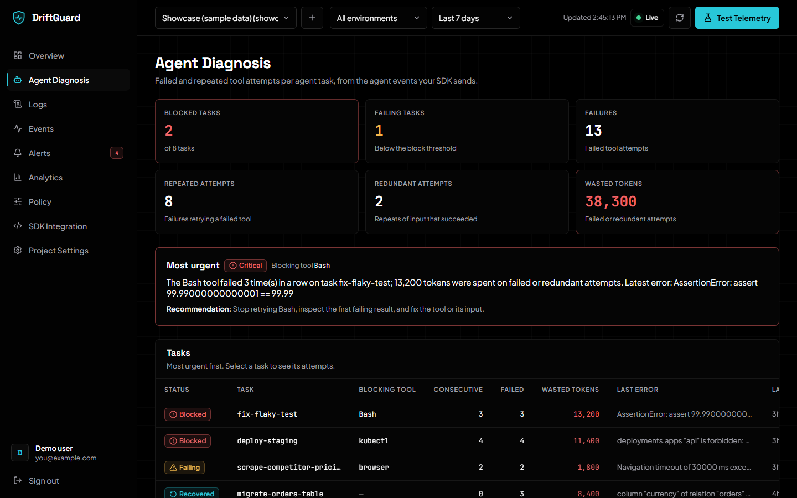
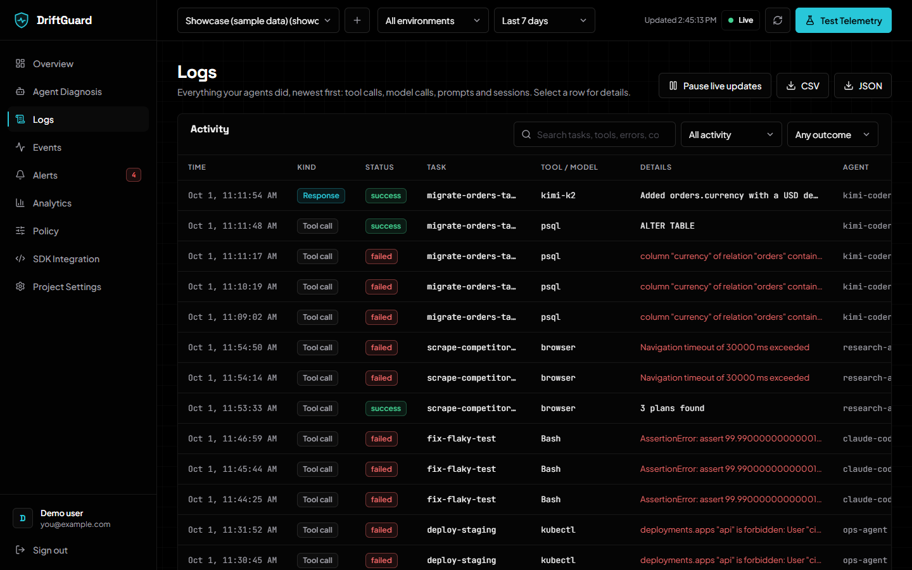
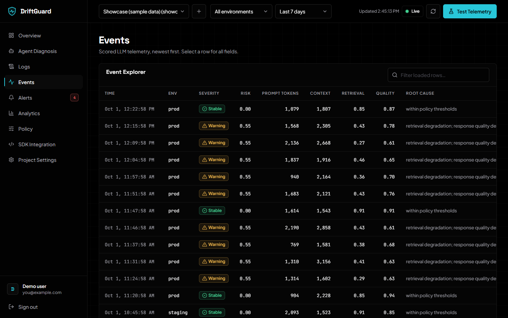
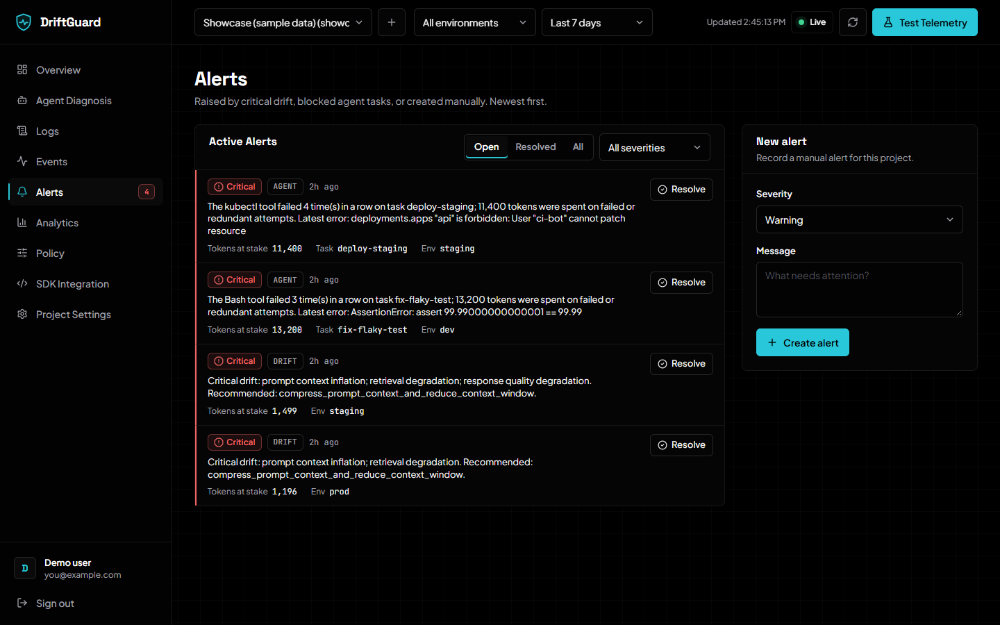
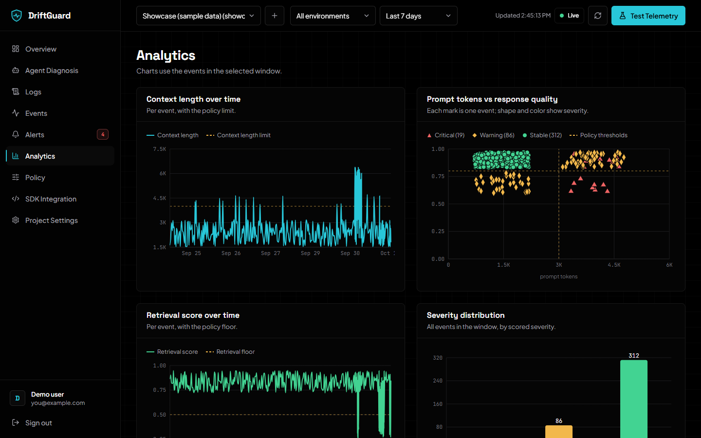

# Dashboard guide

The dashboard is served at the root of your DriftGuard server
(http://127.0.0.1:8000 locally). This page goes through every view: what
question it answers, what each card and column means, and where the numbers
come from.

The screenshots use the **Showcase** sample project
(`examples/seed_showcase.py`, last 7 days).

**One rule for the whole dashboard:** every number comes from the API.
Nothing is estimated or filled in by the browser. A missing value shows as
**—**, and an empty view tells you how to start sending data.

## Map of the dashboard

| Sidebar item | Answers the question | Built from |
| --- | --- | --- |
| [Overview](#overview) | Is anything wrong right now, and how bad is it? | Telemetry, agent events, alerts |
| [Agent Diagnosis](#agent-diagnosis) | Which agent task is stuck, on which tool, and why? | Agent tool calls |
| [Logs](#logs) | What exactly did my agents do? | All agent events |
| [Events](#events) | How was each LLM call scored? | Telemetry |
| [Alerts](#alerts) | What needs attention, and what was handled? | Alerts |
| [Analytics](#analytics) | How are the metrics trending? | Telemetry |
| [Policy](#policy) | What counts as "too much" or "too low" for this project? | Policy |
| [SDK Integration](#sdk-integration) | How do I connect my app? | — |
| [Project Settings](#project-settings) | API key, content storage, deleting the project | Project |

### Which source fills which view

| Source | Overview | Agent Diagnosis | Logs | Events / Analytics | Alerts |
| --- | :-: | :-: | :-: | :-: | :-: |
| SDK `capture_metrics` (telemetry) | ✓ | | | ✓ | drift |
| SDK `@driftguard_tool` / MCP (agent events) | ✓ | ✓ | ✓ | | agent |
| Claude Code hook | ✓ | ✓ | ✓ | ✓ (tokens and context only) | both |
| `seed_showcase.py`, `live_demo.py` | ✓ | ✓ | ✓ | ✓ | both |

## Signing in

Create an account (**Create one** under the form) or sign in with your email and
password. Each account sees only its own projects. If a project is missing from
the picker, you're probably signed in as a different account. Administrators
can close sign-ups with `DRIFTGUARD_ALLOW_SIGNUP=false`.

## The header

| Control | What it does |
| --- | --- |
| **Project** | The application being viewed. **+** creates a project; its API key is shown **once**. |
| **Environment** | `All`, `prod`, `staging`, `dev` or `test`. Filters every view. |
| **Time range** | 15 minutes to 30 days, or all. Filters every view. Default: 24 hours. |
| **Updated** | When the data on screen was last loaded. |
| **Live indicator** | The realtime connection: **Live**, **Connecting**, **Reconnecting** or **Offline**. While live, new alerts and agent activity appear without a refresh, and a new critical alert pops up a notification. |
| **Refresh** | Reloads every view and the project list. |
| **Test Telemetry** | Sends one event with the four metrics you type, and shows how the server scored it. Handy for trying out thresholds. |

The project and filters are remembered in this browser.

## Overview

The landing page. Read it top to bottom: the status pill, the health cards,
agent activity, the most urgent agent problem, then charts and alerts.

**Status pill** (next to the title): `Critical` if any open alert is critical,
`Warning` if any is a warning, otherwise `Stable`.

**LLM health cards**, from telemetry:

| Card | Meaning |
| --- | --- |
| Total events | Telemetry events in the window, split into critical and warning. |
| Open alerts | Unresolved alerts in the window, split by severity. |
| Tokens at stake | The sum of `saved_tokens` over open alerts. For a **drift** alert it's the tokens a mitigation would save; for an **agent** alert it's the tokens already wasted on the blocked task. These are estimates, not invoices. |
| Mean retrieval score | Average 0–1 relevance of retrieved documents; higher is better. Shows the policy floor. It says **Not reported by this source** when telemetry exists but carries no retrieval score, as with Claude Code. |
| Mean response quality | Average 0–1 answer quality from your evaluator. Same "Not reported" rule. |
| Mean risk score | Average server-computed risk per event (see [scoring](#how-events-are-scored)). |

**Agent activity**, from agent events. It's shown once the project has some,
and counts the same rows Logs lists:

| Card | Meaning |
| --- | --- |
| Tool calls | Tool calls in the window, and how many failed. |
| Tool failure rate | Failed ÷ all tool calls. Amber from 10%, red from 25%. |
| Tasks | Distinct tasks, and how many completed (have a final response). |
| Tokens used | New input + output tokens across agent tasks. Each turn is counted once. |
| Avg tool duration | From the call being issued to its result. |
| Agent events | All agent events, and when the last one arrived. |

**Agent Task Diagnosis.** The most urgent agent problem in one sentence: the
blocking tool, the wasted tokens for that task, the latest error, and a
recommendation. **Wasted tokens (all tasks)** adds up every task in the window,
so it can be larger than the figure in the sentence.

**Below the cards:**
- **Telemetry & Drift Timeline.** The latest 500 events in time order. Prompt
  tokens use the left axis; retrieval and quality use the right axis (0–1). A
  dashed line marks the prompt-token limit.
- **Drift Risk Breakdown.** The share of events that broke each policy rule.
- **Top Root Causes.** The most frequent causes among warning and critical
  events. It shows "No drift detected" when every event is stable.
- **Active Alerts.** The five newest open alerts.

## Agent Diagnosis

This view replays each task's **tool calls** and finds the ones that are stuck.
Prompts, answers and session events don't affect it; they're in Logs.

| Card | Meaning |
| --- | --- |
| Blocked tasks | Tasks where one tool has failed at least *blocked after failures* times in a row (3 by default) and hasn't succeeded since. |
| Failing tasks | A shorter run of failures in a row. |
| Failures | All failed tool attempts. |
| Repeated attempts | Failures right after a failure of the same tool: the agent retrying something that just failed. |
| Redundant attempts | Successful calls that repeated an identical input that had already succeeded in the task. |
| Wasted tokens | Tokens of failed attempts plus redundant ones. |

**Most urgent** repeats the top task's diagnosis and recommendation. The
recommendation depends on the error: timeouts, permissions, not found, rate
limits and malformed input each get their own advice.

**Tasks table**, most urgent first:

| Column | Meaning |
| --- | --- |
| Status | **Blocked**, **Failing**, **Recovered** (it failed, then the same tool succeeded) or **Healthy**. |
| Task | The `task_id`. Select a row for every attempt in order, with tool, status, error, tokens and duration. |
| Blocking tool | The tool with the longest open run of failures. |
| Consecutive | The length of that run. |
| Failed | All failed attempts in the task. |
| Wasted tokens | For this task. |
| Last error | The most recent error message, scrubbed of secrets. |
| Last seen | Time of the task's latest event. |

A blocked task raises an **agent** alert. The alert's token count stays
current while the task is blocked, and it **resolves itself** when the task
recovers.

## Logs

The full history of what your agents did, newest first, 100 rows at a time,
with **Load more** for older rows.

| Column | Meaning |
| --- | --- |
| Time | When it happened. |
| Kind | **Tool call**, **Model call**, **Prompt**, **Response** (the final answer of a turn), **Session start** or **Session end**. |
| Status | `success`, `failed`, `error`, `timeout`, or `info` for non-tool rows. |
| Task | The task it belongs to. |
| Tool / model | The tool for a tool call; the model for model calls and responses. |
| Details | The error for failures; otherwise the stored output or input, if any. |
| Agent | The agent's name, for example `claude-code`. |
| Attempt | The attempt number of this tool call within the task. Empty for non-tool rows. |
| Duration | How long it took. For a response, the whole turn. |
| Tokens | Tokens used. For a response, the whole turn's total. A tool call that shared a model call with the call before it shows 0, so tokens aren't counted twice. |

- **Search** runs on the server, over everything in the time range: task,
  tool, agent, model, errors and stored content.
- **All activity / Any outcome** narrow it to one kind, or to failures or
  successes.
- **Pause live updates** freezes the list while you read. New rows are added
  again when you resume.
- **CSV / JSON** download the filtered log (up to the newest 10,000 rows).
- **Select a row** to see every field, the error, and any stored input and
  output. **Show only this task** filters the log to that task.

**Content storage.** By default only metadata is stored: names, statuses,
errors, timings and tokens. To keep inputs and outputs too, such as the command
an agent ran or the prompt, turn on **Content storage** in Project Settings. The
sender must allow it as well (`capture_content=True` in the SDK, or
`"capture_content": true` for the Claude Code hook). Logs shows a notice while
it's off.

## Events

Raw LLM telemetry, newest first, 100 rows at a time, with the server's verdict on
each row. The search box filters the rows already loaded.

| Column | Meaning |
| --- | --- |
| Time, Env | When, and in which environment. |
| Severity | Stable, warning or critical (see [scoring](#how-events-are-scored)). |
| Risk | 0–1, the sum of the rules broken. |
| Prompt tokens | New input tokens of the request. |
| Context | Total context the model saw. |
| Retrieval | RAG relevance 0–1, or **—** if not sent. |
| Quality | Answer quality 0–1, or **—** if not sent. |
| Root cause | Why it was scored that way, for example `prompt context inflation` or `retrieval degradation`. Several causes are joined with `;`. A clean event says `within policy thresholds`. |

On narrow screens the table scrolls sideways, and Root cause is the last
column. Select a row to see every field, including the `metadata` your app
attached (for Claude Code: model, task and request ID).

## Alerts

**Open**, **Resolved** and **All** tabs, plus a severity filter. Each alert
shows its severity, its **source**, how long ago it fired, the tokens at stake,
and its task or environment.

| Source | Raised when | Resolves |
| --- | --- | --- |
| **drift** | A telemetry event scores critical. Repeats of the same root cause within the cooldown (15 min) don't create new alerts. | By hand |
| **agent** | A task becomes blocked. | **Automatically** when the task recovers |
| **manual** | You create one with **New alert**, or through the API. | By hand |

**Resolve** and **Reopen** apply for everyone on the project. Resolved alerts
stop counting toward the status and the sidebar badge, and retention eventually
removes them. Open alerts are never pruned. Critical alerts can also go to
Slack or a webhook ([configuration.md](configuration.md#notifications)).

## Analytics

Charts over the latest 500 events in the window:

- **Context length over time**, with the limit dashed. Spikes above the line
  are context bloat.
- **Prompt tokens vs response quality.** One mark per event, shaped and
  coloured by severity. Marks drifting right and down mean more tokens for
  worse answers. Treat it as a clue, not proof.
- **Retrieval score over time**, with the floor dashed. Dips below it are
  retrieval regressions.
- **Severity distribution** for the window.

## Policy

The project's thresholds. Saving changes how **new** events are scored and how
the diagnosis runs, on the server and in any SDK that calls `fetch_policy()`.
Stored events keep their scores.

| Setting | Default | Meaning |
| --- | ---: | --- |
| Prompt token limit | 3000 | Broken when `prompt_tokens` is above it. |
| Context length limit | 4000 | Broken when `context_length` is above it. |
| Retrieval score floor | 0.50 | Broken when `retrieval_score` is below it. |
| Response quality floor | 0.80 | Broken when `response_quality` is below it. |
| Blocked after failures | 3 | Failures in a row of one tool before a task is blocked. |
| Retry window (minutes) | 60 | Failures further apart start a new run. 0 turns it off. |

The defaults suit chat apps. A coding agent like Claude Code sends far larger
requests: about **30000** prompt tokens and **400000** context are sensible
there. **Reset** discards unsaved edits.

## SDK Integration

Copyable Python snippets for the current project and server URL: install,
telemetry, agent events, the decorator and MCP. The API key appears only as
its prefix (`dg_live_ab12…`). Use the key you saved, or rotate a new one.

## Project Settings

- **Rotate API key** issues a new key, shown once. The old one stops working
  immediately.
- **Content storage** decides whether agent events keep their inputs and
  outputs; it's off by default. Stored content is scrubbed of secrets, emails
  and card numbers, capped at 2,000 characters per field, and deleted with
  retention (30 days by default). Turning it off stops new content; content
  already stored stays until retention removes it.
- **Delete project** removes the project and all its data. To confirm, you type
  the project ID.

## How events are scored

Each broken policy rule adds risk:

| Rule | Risk |
| --- | ---: |
| Prompt token limit | 0.25 |
| Retrieval score floor | 0.35 |
| Context length limit | 0.20 |
| Response quality floor | 0.20 |

The total is capped at 1.0. Below **0.4** is **stable**, 0.4 up to 0.75 is
**warning**, and **0.75** or above is **critical**, which raises a drift alert.
A metric you didn't send never breaks a rule, so a single broken rule on its
own (0.20–0.35) stays stable. Worked examples are in
[concepts.md](concepts.md#how-a-telemetry-event-is-scored).

The recommended actions:
- `compress_prompt_context` for prompt or context inflation
- `trim_retrieval_results` for retrieval degradation
- `fallback_to_lower_cost_model` for a quality drop

They're **recommendations**. DriftGuard doesn't change your prompts or
providers.

## Metric definitions

| Metric | Meaning |
| --- | --- |
| `prompt_tokens` | Tokens in the model request's input. For Claude Code, new input only; cached context is left out. |
| `context_length` | Everything the model saw: history, retrieved documents, system prompt, cached context. |
| `retrieval_score` | 0–1 relevance from your RAG pipeline. Leave it out if you don't use retrieval. |
| `response_quality` | 0–1 from your evaluator, validation checks or user feedback. Leave it out if you have none. |
| `environment` | `prod`, `staging`, `dev` or `test`. |
