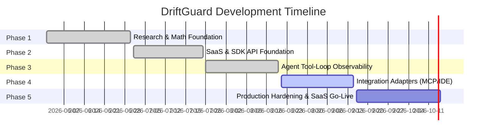

# DriftGuard Project Phases & Roadmap

This document outlines the development lifecycle of **DriftGuard**, summarizing the work completed in each phase and detailing the tasks left to do for future milestones.

---

---

## Phase 1: Research and Math Foundation (Completed)

This phase focused on defining the core math behind detecting runtime drift in LLM outputs and validating detection accuracy on synthetic runs.

### What Was Done
- **Math & Scoring Models**: Developed the mathematical formulas for prompt drift, context window expansion, retrieval noise, and quality degradation in [detector.py](file:///c:/Users/SEAN/OneDrive/Desktop/DriftGuard/driftguard/detector.py).
- **Synthetic Data Generation**: Implemented a simulation engine in [data.py](file:///c:/Users/SEAN/OneDrive/Desktop/DriftGuard/driftguard/data.py) to model healthy vs. drifting LLM agent behaviors.
- **Reproducible Benchmarking**: Created benchmark scenarios and score comparisons in [benchmark.py](file:///c:/Users/SEAN/OneDrive/Desktop/DriftGuard/driftguard/benchmark.py).
- **Verification Engine**: Built an experiment runner in [experiment.py](file:///c:/Users/SEAN/OneDrive/Desktop/DriftGuard/driftguard/experiment.py) and a markdown reporting system in [reporting.py](file:///c:/Users/SEAN/OneDrive/Desktop/DriftGuard/driftguard/reporting.py) to validate models.

---

## Phase 2: SaaS Core & Developer SDK (Completed)

This phase established the backend APIs, the client library, and the basic developer visualization interface.

### What Was Done
- **SDK client library**: Developed the [DriftGuardClient](file:///c:/Users/SEAN/OneDrive/Desktop/DriftGuard/driftguard/client.py) which exposes metrics capturing and asynchronous dispatch capabilities.
- **FastAPI backend API**: Created the endpoints inside [routes.py](file:///c:/Users/SEAN/OneDrive/Desktop/DriftGuard/driftguard/routes.py) for project creation, telemetry ingestion, policy fetching, and dashboard telemetry aggregation.
- **Database schema**: Implemented SQLite schemas via SQLAlchemy for project profiles, API keys, raw event telemetry, and alerts.
- **Web-based dashboard**: Built a single-page app in [index.html](file:///c:/Users/SEAN/OneDrive/Desktop/DriftGuard/driftguard/static/index.html) and [dashboard.js](file:///c:/Users/SEAN/OneDrive/Desktop/DriftGuard/driftguard/static/dashboard.js) with real-time graphs showing token usage, context length, and system state.

---

## Phase 3: Agent Tool-Loop Observability (Completed)

This phase added specialized telemetry structure to analyze agent retry loops, identify blocking tools, and calculate financial/token waste.

### What Was Done
- **Tool telemetry schema**: Added support for task trace tracking, tool invocation logs, and failure states.
- **Tool-Loop diagnosis**: Created algorithms to group events by task trace, count repeated failures, and identify the primary blocking tool.
- **Financial/Token waste calculation**: Added logic to count tokens wasted during failing runs and display equivalent dollar savings.
- **Dashboard UI Panel**: Built a **Task Diagnosis** component inside the web dashboard to show developers which tool is causing their agent loops to spin.
- **Testing**: Authored pytest suites in [tests/](file:///c:/Users/SEAN/OneDrive/Desktop/DriftGuard/tests) verifying the correct behavior of retry parsing and billing aggregation.

---

## Phase 4: Integration Adapters (Active & In Progress)

The goal of this phase is to interface DriftGuard with real agent loops (such as Antigravity, AutoGPT, or LangChain) and tool gateways.

### What Is Left to Do
- `[ ]` **Python Agent Wrapper**: Implement a concrete Python function wrapper/decorator to automatically capture tool inputs/outputs and token usage from standard LLM loop frameworks.
- `[ ]` **MCP Gateway Interceptor**: Build a Model Context Protocol (MCP) gateway middleware to inspect and log tool executions and errors seamlessly without modifying the host agent code.
- `[ ]` **IDE / VS Code Extension Feasibility**: Investigate the possibility of utilizing VS Code or GitHub Copilot APIs to extract conversation history length and tool usage for developers inside the IDE.

---

## Phase 5: Production Hardening & SaaS Go-Live (Future)

This phase will focus on scaling, security, and making DriftGuard production-ready.

### What Is Left to Do
- `[/]` **Security and Authentication**:
  - `[x]` Implement OAuth2 / JWT authentication for the dashboard.
  - `[ ]` Setup SSL/TLS configurations.
  - `[ ]` Integrate secret management (for API keys).
- `[/]` **Production Storage Migration**:
  - `[x]` Replace SQLite with PostgreSQL for ingestion scale.
  - `[ ]` Add Redis for caching current policies and rate-limiting.
- `[x]` **Active Notifications / Alerting**:
  - `[x]` Implement WebSockets/SSE for live alerts.
  - `[x]` Integrate email (SendGrid) and Slack webhook alerts for critical drift triggers.
- `[x]` **Packaging & Distribution**:
  - `[x]` Prepare `setup.py` / `pyproject.toml` configuration to publish the `driftguard` package on PyPI.
- `[x]` **Data Retention & Privacy Compliance**:
  - `[x]` Build worker scripts to clean/prune telemetry after retention periods.
  - `[x]` Add anonymization filters to clean PII from LLM prompt inputs before database writes.

---

## Phase 6: Enterprise Readiness & Deployability (Active)

With the core security and functionality complete, this phase focuses on making the SaaS backend easy to self-host for enterprise clients and scaling the data layer.

### What Is Left to Do
- `[x]` **High-Performance Caching**:
  - `[x]` Implement Redis for caching project policies and handling distributed rate-limiting.
- `[ ]` **Secret Management & SSL**:
  - `[ ]` Build integration for external secret managers (e.g., AWS Secrets Manager, HashiCorp Vault) and enforce SSL/TLS configuration for self-hosted instances.
- `[x]` **Deployment Blueprints**:
  - `[x]` Create a `docker-compose.yml` for easy 1-click self-hosting (bundling FastAPI, PostgreSQL, and Redis).
  - `[ ]` Draft a basic Helm Chart for Kubernetes deployments.
- `[ ]` **Advanced Dashboard Visualizations**:
  - `[ ]` Add full agent-trace waterfall visualizations to the frontend to complement the tool diagnosis.
